# Architecture diagrams

Source: [`diagrams/objex.mmd`](diagrams/objex.mmd), one Mermaid diagram per `%%% Title` section. Edit the source, then run [`diagrams/render.sh`](diagrams/render.sh) to regenerate the SVGs. For a live view with pan and zoom, serve the `diagrams` folder (`python3 -m http.server 8765`) and open [`diagrams/index.html`](diagrams/index.html).

The architecture diagram uses the ELK layout engine, which GitHub's Mermaid renderer does not ship. That is why the SVGs are committed, in a light and a dark variant; GitHub picks one via `<picture>`.

## 1. Architecture

One process, two Kestrel listeners. Requests are split by the TCP port they arrived on: the S3 pipeline on port 9000 authenticates with AWS Signature V4, the UI pipeline on port 9001 with the Identity cookie. Both end in the same services. Core interfaces are shown together with their Infrastructure implementation. Every node links to its source file.

<picture>
  <source media="(prefers-color-scheme: dark)" srcset="diagrams/01-architecture.dark.svg">
  
</picture>

## 2. S3 PutObject · staged write

The order of checks on a single-part upload. The body is written to a temporary file first. Content-MD5 and the quota are checked after the write, and a failure disposes the staged file while the previous object keeps its bytes and its row. Only the commit moves the file into place, and only then is the row written together with the bucket statistics and the audit entry.

<picture>
  <source media="(prefers-color-scheme: dark)" srcset="diagrams/02-s3-putobject-staged-write.dark.svg">
  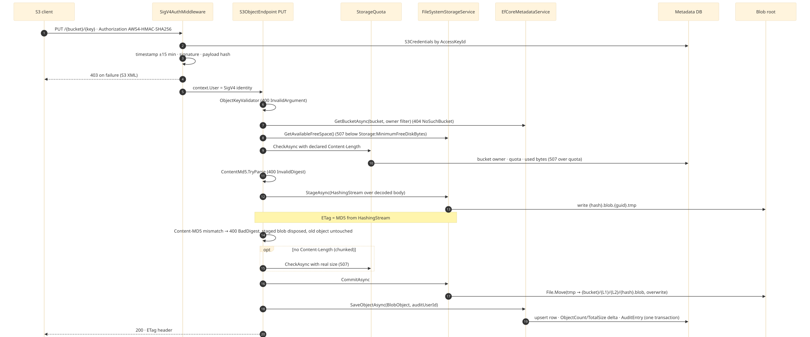
</picture>

Mermaid source

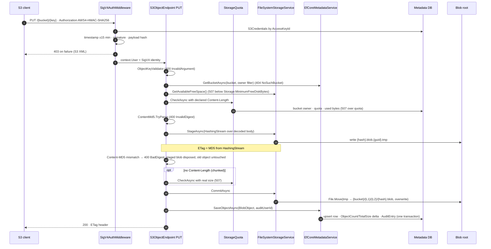

## 3. S3 Multipart upload

Initiate, the UploadPart loop with its upsert, and Complete with every validation the endpoint performs before it assembles the parts. The multipart ETag is the MD5 of the concatenated part MD5 bytes followed by the part count. Abort and the weekly cleanup job are noted at the bottom.

<picture>
  <source media="(prefers-color-scheme: dark)" srcset="diagrams/03-s3-multipart-upload.dark.svg">
  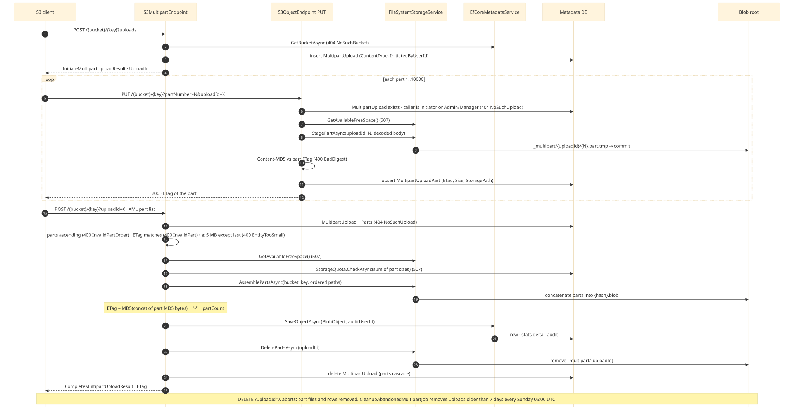
</picture>

Mermaid source

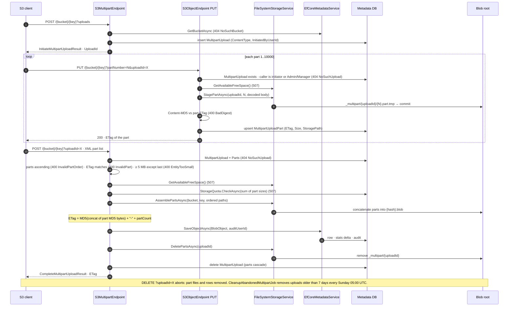

## 4. Browser login · cookie session

Blazor Server cannot set cookies from a circuit, so the login is a plain form POST to a minimal API endpoint. The diagram shows the lockout, deactivation and expired temporary password branches, the cookie lifetime with and without "Stay signed in", and the redirect to the forced password change.

<picture>
  <source media="(prefers-color-scheme: dark)" srcset="diagrams/04-browser-login-cookie-session.dark.svg">
  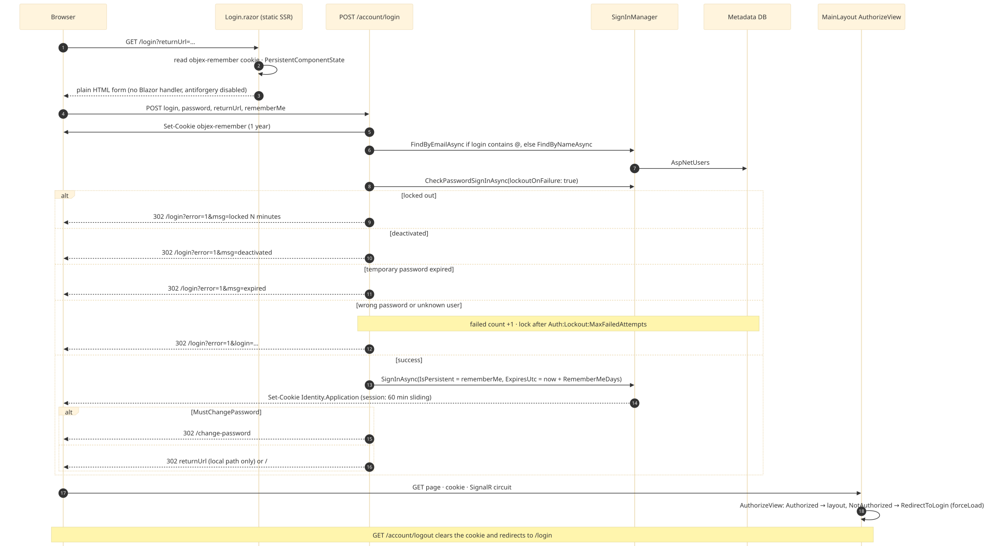
</picture>

Mermaid source

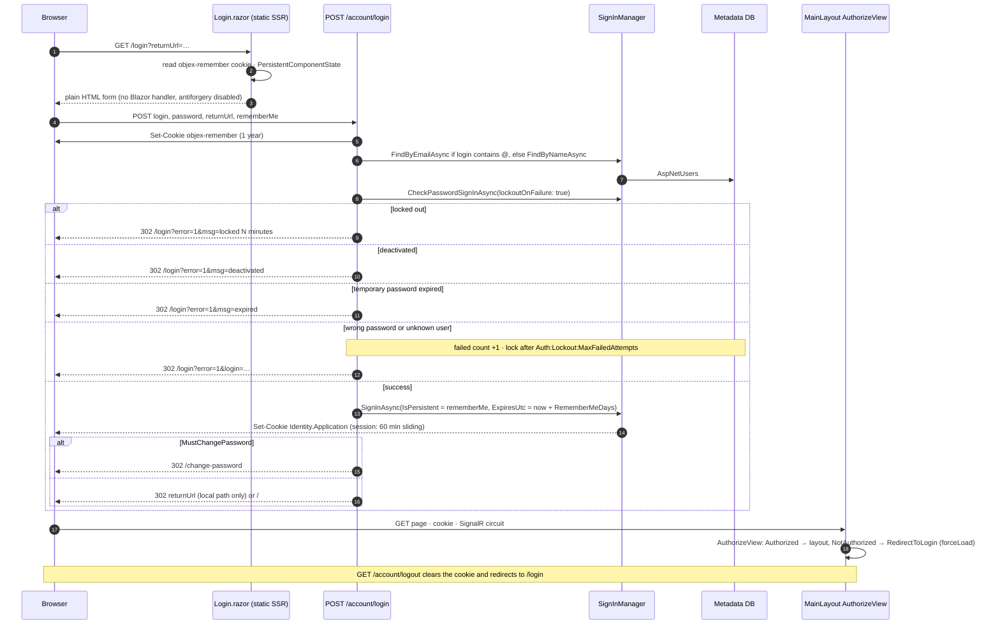

## 5. Presigned URL · UI to S3 port

A presigned link is generated on the UI port with the cookie session and consumed on the S3 port with no headers at all. The middleware caps X-Amz-Expires at the maximum from SystemSettings, itself capped at the AWS limit of seven days.

<picture>
  <source media="(prefers-color-scheme: dark)" srcset="diagrams/05-presigned-url-ui-to-s3-port.dark.svg">
  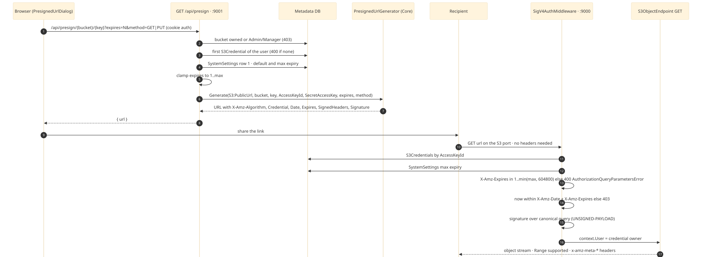
</picture>

Mermaid source

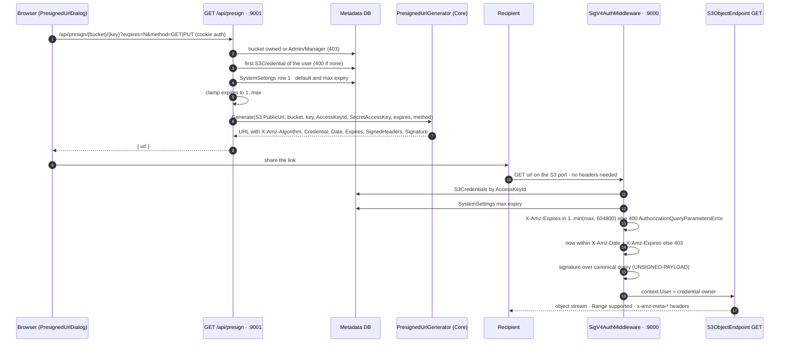

## 6. Data model

All tables with keys, unique indexes and delete behaviour. Objects reference the bucket by name, not by its id. Audit entries carry the user id without a foreign key so they survive user deletion.

<picture>
  <source media="(prefers-color-scheme: dark)" srcset="diagrams/06-data-model.dark.svg">
  
</picture>

Mermaid source

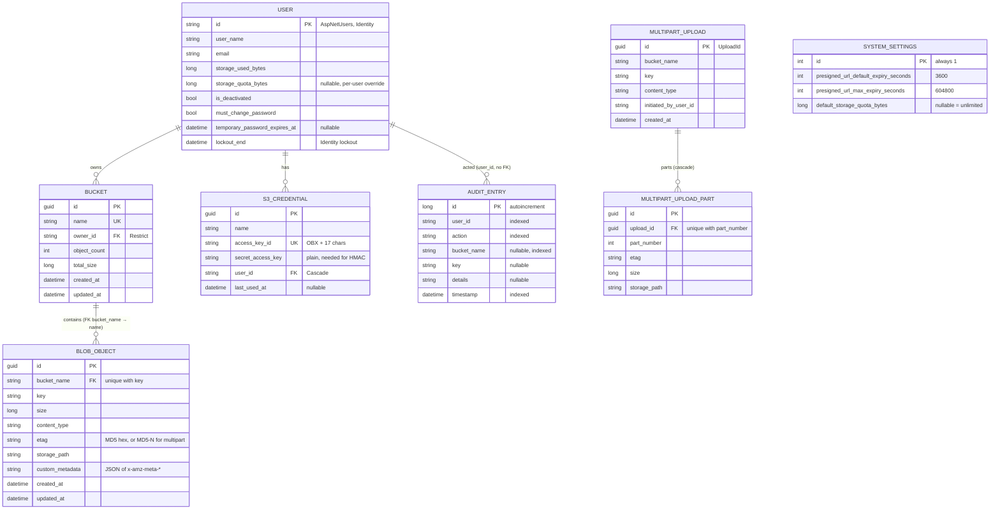

## 7. Staged blob lifecycle

The states a blob file can be in between the first byte and the metadata row, and which mechanism cleans up each failure mode: the disposal in the request, the startup sweep for stale temporary files, and the weekly orphan job.

<picture>
  <source media="(prefers-color-scheme: dark)" srcset="diagrams/07-staged-blob-lifecycle.dark.svg">
  
</picture>

Mermaid source

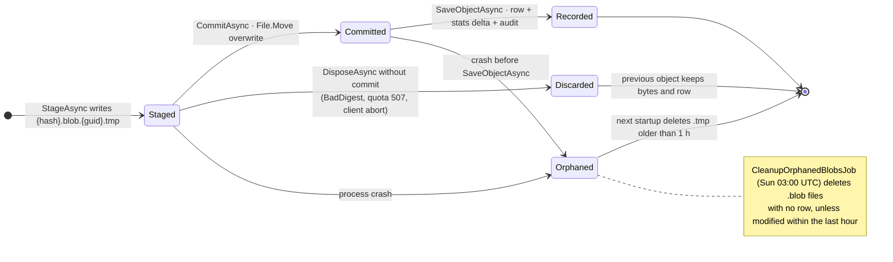

